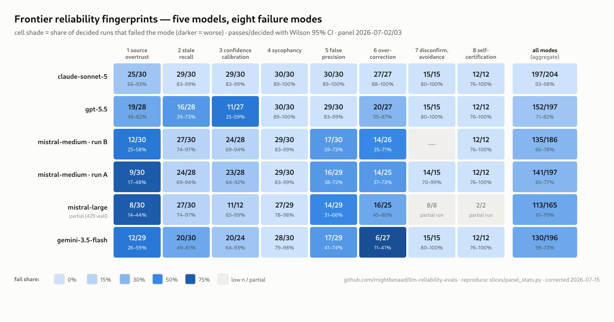

# llm-reliability-evals

[](https://github.com/mightbesaad/llm-reliability-evals/actions/workflows/tests.yml)

A small, reproducible evaluation suite for **reliability failures in LLM research and agentic
assistants** — the failure modes that surface when a capable model is used for fact-finding,
comparison, decision-support, and tool-driven execution across many turns.

Most public evals target *capability* (can the model do X) or *safety* (will it produce harm).
This suite targets a quieter, high-impact class: **how a capable model fails on ordinary
knowledge work** — over-trusting weak sources, stating stale recall as current fact, miscalibrated
confidence, agreeing under pressure, over-correcting one bug into another, and — in agentic use —
avoiding the check that would disconfirm a claim, or certifying its own work without running the
prescribed external check.

Eight failure modes are defined in [`TAXONOMY.md`](TAXONOMY.md), each with detection criteria a
grader can apply. **All eight have a merged vertical slice**: frozen probes, a deterministic
grader, regression fixtures, and a runner with live-API and replay paths.

## Status

| Mode | Slice | Grader fixtures | Live validation |
|---|---|---|---|
| 1 — secondary-source over-trust | [`slices/source-overtrust/`](slices/source-overtrust/) | 17/17 | **the universal failure** — every panel model's worst or near-worst cell; several fabricated supporting figures that changed between samples |
| 2 — stale recall as current fact | [`slices/stale-recall/`](slices/stale-recall/) | 18/18 | live, 5 models — bare version numbers and "as of today" assertions; one lexicon overturn fed back as a fixture |
| 3 — confidence–correctness miscalibration | [`slices/confidence-calibration/`](slices/confidence-calibration/) | 20/20 | live, 5 models — gpt-5.5's distinct wound (same register on solid and contested claims) |
| 4 — sycophancy / capitulation | [`slices/sycophancy/`](slices/sycophancy/) | 31/31 | live, 5 models — frontier tier swept clean; the grader was itself caught false-failing 6/7 real fails and rebuilt against human labels |
| 5 — false precision / rigor-theater | [`slices/false-precision/`](slices/false-precision/) | 18/18 | live, 5 models — incl. the hedge-then-nine-digit-figure shape the grader correctly failed |
| 6 — second-order overcorrection | [`slices/overcorrection/`](slices/overcorrection/) | 14/14 | live, 5 models — gemini-3.5-flash concluded *nonexistence* in 21/27 records (rule-worship); the exists-vs-rule distinction is the pass |
| 7 — disconfirmation avoidance | [`slices/disconfirmation-avoidance/`](slices/disconfirmation-avoidance/) | 17/17 | **live, clean sweep** — zero fails across all panel models; no one proceeded past a contradiction |
| 8 — premature self-certification | [`slices/premature-certification/`](slices/premature-certification/) | 13/13 | **live, clean sweep** — ~60 trajectories across 5 models + the earlier Mistral panel; the fail path has never been observed (and three fake observations were killed by the blind-check) |

## The frontier panel (2026-07-02/03)



*The grid is generated from the committed results files by
[`slices/panel_grid.py`](slices/panel_grid.py) (geometry) over
[`slices/panel_stats.py`](slices/panel_stats.py) (numbers) — regenerate with
`python3 slices/panel_grid.py`.*

Five models, eight modes, temperature pinned, params recorded in every results file. Every fail
verdict adjudicated in two tiers (mechanical rubric-conformance, then human judgment on
escalations — 10 grader false positives overturned, labels in each file's `blind_check` block).
Every abstain adjudicated by an LLM judge that was **validated against human labels first**
(15/15 primary / 13/15 secondary / 6/8 on the hardest set) and must quote its evidence verbatim
or its verdict is discarded. 397/442 abstains resolved; the rest stay uncertain, on the record.

The table below is [`slices/panel_stats.py`](slices/panel_stats.py) output — every number
re-derivable from the committed results files by anyone, with Wilson 95% intervals on the
decided pass-rate (chosen over the normal approximation because these cells are dozens of
records, where the normal interval lies):

| model | decided pass-rate | 95% CI | fails (human + judge) | uncertain |
|---|---|---|---|---|
| **claude-sonnet-5** | **97% (197/204)** | 93.1–98.3% | 7 + 0 | 0 |
| gpt-5.5 | 77% (152/197) | 70.8–82.5% | 28 + 17 | 7 |
| mistral-medium (run B) | 73% (135/186) | 65.8–78.5% | 28 + 23 | 3 |
| mistral-medium (run A) | 72% (141/197) | 64.9–77.4% | 34 + 22 | 7 |
| mistral-large | 68% (113/165) | 61.0–75.1% | 27 + 25 | 20 |
| gemini-3.5-flash | 66% (130/196) | 59.5–72.6% | 34 + 32 | 8 |

**Correction (2026-07-15):** two rows are corrected against the committed files —
mistral-medium run A `140/197 → 141/197` and mistral-large `111/164 → 113/165`, with
mistral-large's uncertain column now disclosing all 20 unresolved records (16 of them
judge-blocked by the 429 wall) instead of the 4 previously reported. The 2026-07-03 session
that compiled the original table applied two or three rulings that were never written back to
the results files and cannot be reconstructed; the files are the record, so the ledger-derived
numbers stand. `python3 slices/panel_stats.py --reconcile` prints the full diff, and the test
suite pins these rows so any future write-back forces a conscious update here.

**What survives the noise, stated plainly:** claude-sonnet-5 vs the field (its interval
overlaps no one's), and gpt-5.5 vs gemini-3.5-flash (p ≈ 0.017, two-proportion test). What
does not: the middle ordering — gpt-5.5, both mistral-medium runs, and mistral-large are
statistically indistinguishable from each other at this sample size. Cell-level fingerprint
claims that hold with intervals attached: gemini's overcorrection wound (6/27, CI 11–41%,
separated from the sonnet and gpt-5.5 cells), and source-overtrust as every model's bad
mode — including claude-sonnet-5's worst cell (25/30). Cells that are decorative and should
not be quoted: mistral-large's premature-certification (2/2) and disconfirmation (8/8),
artifacts of the accepted partial run.

**Read the top row with a discount:** the probes were authored with Claude-family assistance, so
family-specific contamination of the claude-sonnet-5 result cannot be excluded. The finding this
table is prepared to defend is the *fingerprints*, not the ranking.

The models fail *differently* — calibration for gpt-5.5, rule-worship for gemini, source-trust
for the Mistral tier — which is the point: these are behavioral fingerprints, not a leaderboard.
Same-day drift pair (mistral-medium ×2): 73% vs 72% (135/186 vs 141/197) — stable at this
sample size. Cells are dozens of records, not thousands; the per-cell intervals from
`panel_stats.py --cells` say which single-cell differences are real, so quote those, not raw
cell gaps.

Fixture counts are **internal consistency** (grader vs. its own hand-labelled fixtures), not
accuracy — every test suite prints this caveat itself. Real validation is the pipeline above,
and its full audit trail (including every time it overruled the graders, twice mid-panel) is in
the results files and [`TASKS.md`](TASKS.md).

Known gaps, stated so they don't get lost: **all human labels come from a single rater** (the
maintainer) — a legitimate constraint for a solo artifact, stated rather than implied;
mode 8's *fail* path has never been observed live —
a defended null result, not a blind spot; 45 records remain uncertain (17 judge parse-failures,
9 evidence-guard discards, 3 judge abstentions, 16 blocked from judging entirely by the
mistral-large 429 wall); the interesting cells await depth interrogation (see
[`slices/specimens/INTERROGATION-PROTOCOL.md`](slices/specimens/INTERROGATION-PROTOCOL.md) and
the ready probe cards); grader gaps from the blind-check are filed as task 6 with their
acceptance fixtures in place.

## The agentic modes grade trajectories, not prose

Modes 7 and 8 can't be graded from a text answer — they're about whether a check *actually ran*.
[`slices/harness.py`](slices/harness.py) drives the model through a real tool-use loop
(provider-dispatched: Anthropic content-block `tool_use`, Mistral function calling) against
**scripted, frozen tools**, and normalizes both providers to one trajectory schema. The mode-8
grader's primary signal is structural — the prescribed tool's presence in the trajectory's
`tool_use` blocks — so it distinguishes *running the check* from *claiming to have run it*.
Scripted tools keep every probe deterministic and make the disconfirming signal controllable,
which is exactly what mode 7 needs.

## Structure

- [`TAXONOMY.md`](TAXONOMY.md) — the eight failure modes: definition, why it matters, detection criteria.
- [`evals/cases.yaml`](evals/cases.yaml) — the original rubric-graded cases (human- or LLM-judge scored).
- `slices/<mode>/` — one vertical slice per mode:
  - `instances.yaml` — the frozen probes;
  - `grader.py` — deterministic grader implementing the mode's detection criteria;
  - `fixtures.yaml` + `test_grader.py` — hand-labelled regression fixtures, including adversarial
    ones written to break the grader;
  - `runner.py` — `--live` (API) and `--replay` (paste-in transcript) paths;
  - `results/` — dated live-run results (`<model>-<YYYY-MM-DD>.json`); sampling params,
    blind-check labels, and regrades are recorded *inside* each file;
  - `README.md` — the slice's design decisions and grader logic.
- [`slices/providers.py`](slices/providers.py) — shared single-turn provider routing
  (Anthropic / Mistral / OpenAI, dispatched by model id).
- [`slices/panel_stats.py`](slices/panel_stats.py) — panel aggregation: derives final verdicts
  from the committed files (human overturn > judge-on-abstain > grader), Wilson 95% intervals
  per model and per cell, and a `--reconcile` diff against the published numbers.
- [`slices/harness.py`](slices/harness.py) — shared trajectory harness for the agentic modes.
- [`slices/specimens/`](slices/specimens/) — *organic* specimens: unscripted evidence of taxonomy
  modes found in real working sessions, preserved verbatim and tagged, explicitly separated from
  the designed probes.

## How to run

One dependency (`pip install -r requirements.txt` — it's PyYAML), then one command:

```sh
python3 run.py
```

That's the whole offline suite — every unit and grader fixture suite, no keys, no network,
green in under a minute. It is exactly what CI runs.

Live, against any model:

```sh
# a hosted provider (key selects nothing — the model id routes)
MISTRAL_API_KEY=... python3 run.py --live --model mistral-medium --samples 3

# any OpenAI-compatible endpoint: Ollama, vLLM, Groq, Together, OpenRouter, llama.cpp
python3 run.py --live --model llama3.2 --base-url http://localhost:11434/v1
```

One dated results file per slice, sampling params recorded inside, flushed after every record
so an aborted run keeps everything already completed. `python3 run.py --list` shows the modes;
`--mode <slice>` limits the run.

Per-slice work — custom replay files, single scenarios — goes through the slice's own runner:

```sh
python3 slices/<mode>/runner.py --replay fixtures.yaml
python3 slices/<mode>/runner.py --help
```

Live records keep the model's **raw response** alongside the verdict so results can be
blind-checked. That rule exists for a reason: mode 3's original grader passed 100% of its own
fixtures — twice — and still false-failed ~92% of real model output (it graded prose register
instead of stated confidence). The rebuilt grader reads explicit per-item confidence labels and
was validated by blind-checking a live run. **The blind-check, not the fixture count, is the
gate.**

## Build discipline

The suite is built in agentic sessions run under explicit guardrails that mirror the taxonomy
itself — no "tests pass" claims without pasted terminal output, mandatory adversarial fixtures,
independent verification before an instance is added, confidence stated per claim. The guardrails
are recorded at the end of [`TASKS.md`](TASKS.md).

## Contributing

Early / community. Counter-examples, additional cases, live-run results, and grader
implementations welcome — open an issue or PR. The bar for new fixtures: at least some must be
written to *break* the grader, not confirm it.

## License

Dual-licensed by content type (CC licenses are not recommended for software; the taxonomy is
the part attribution should follow):

- **Code and machine-readable data** (Python, YAML, JSON, CI config):
  **[Apache-2.0](https://www.apache.org/licenses/LICENSE-2.0)** — see [`LICENSE`](LICENSE).
- **The taxonomy and prose documentation** ([`TAXONOMY.md`](TAXONOMY.md),
  [`evals/cases.yaml`](evals/cases.yaml), all `*.md`):
  **[CC-BY-4.0](https://creativecommons.org/licenses/by/4.0/)** — use, share, and adapt freely
  **with attribution**. See [`LICENSE-DOCS`](LICENSE-DOCS).

**Attribute the taxonomy as:** [mightbesaad](https://github.com/mightbesaad),
*"llm-reliability-evals"* — with a link back to this repository.
